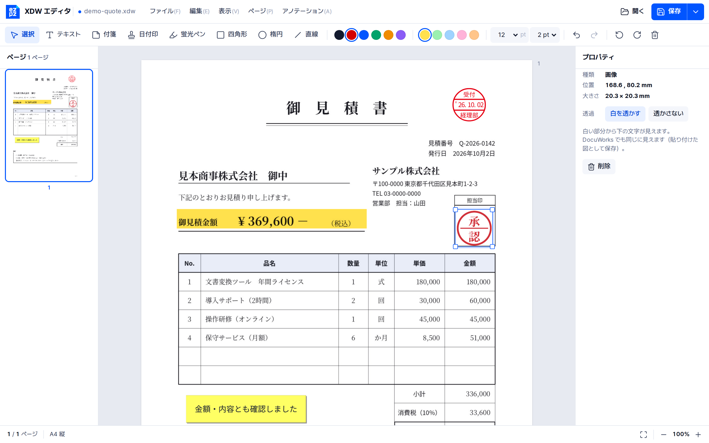

<p align="center">
  
</p>
<h1 align="center">EZPZ File XDW</h1>
<p align="center"><a href="README.md">日本語</a> · <b>English</b> · <a href="README.ko.md">한국어</a></p>
<p align="center">
  <a href="https://ezpzfile.com/xdw-editor"></a>
</p>
<p align="center"><sub>Demo: <a href="https://ezpzfile.com/xdw-editor">English</a> · <a href="https://ezpzfile.com/ja/xdw-editor">日本語</a></sub></p>

**Open, annotate and save DocuWorks (`.xdw`) documents anywhere: Mac, Linux, phone, browser.**
An open-source engine, editor and format specification for FUJIFILM (Fuji Xerox)
DocuWorks files, built from scratch. Files never leave your device.

Status: **v0.2, viewer + editor that saves back to `.xdw` / `.xbd` (developer preview).**
Not affiliated with FUJIFILM Business Innovation.

[](https://ezpzfile.com/xdw-editor)

<sub>A sample quotation with a date stamp, highlighter, sticky note and a see-through approval seal. It looks the same in DocuWorks.</sub>

## What works

Tested on 43 public DocuWorks files (generation 7 and 10, `.xdw` and `.xbd`):

- all 43 open, every page draws with no unknown drawing records
- pages: EMF and WMF drawings, the DocuWorks driver's own compact path and
  picture records, JPEG picture strips, scanned/rotated pages, annotations
- **saving back to `.xdw`**, the way DocuWorks itself saves (one segment appended,
  nothing earlier rewritten). Saved files open in **DocuWorks Viewer Light**
- annotations: add **text, sticky note (付箋), date stamp (日付印), highlighter,
  rectangle, ellipse, line, picture**; move, resize, change, delete (existing
  annotations from DocuWorks too: move / delete). A picture can be
  **see-through**: its white parts show the text underneath, in DocuWorks too
- **select and copy text** in pages, **search** the document (Ctrl+F)
- pages: turn left / right, delete, reorder (drag in the page list);
  **insert** a blank page, pictures (JPEG / PNG / …), pages of another `.xdw` /
  `.xbd`, or PDF pages (as pictures; needs the network once for pdf.js)
- **binders (`.xbd`)**: documents shown in the page list; add `.xdw` files,
  rename, reorder, remove documents
- export: **PDF** (looks like the screen, text searchable/copyable), plain text; print
- undo / redo

The format findings, including the check value DocuWorks verifies and the
driver's private drawing records, are in [docs/spec/XDW-FORMAT.md](docs/spec/XDW-FORMAT.md).

Signed documents open, and selecting a signature shows its information (an
electronic seal or a certificate, the signing module, the version). Editing
voids the signature, and the editor says so.

Documents protected by a password or a certificate are reported as protected,
with a note to remove the protection in DocuWorks first (this editor never
handles passwords).

Not yet: verifying that a signature still holds, and adding signatures or
passwords. See the [plan](docs/PLAN.en.md)
([日本語](docs/PLAN.ja.md), [한국어](docs/PLAN.ko.md)).

## Editor

`web/dist/ezpzxdw-editor.html` is the whole editor in one file: double-click it,
drop a `.xdw` on the window, annotate, and save (Ctrl+S → `.xdw`). The screen
follows DocuWorks Viewer (page list on the left, annotation tools on top,
properties on the right) in the EZPZ File design. Keys: T text, S sticky note,
D date stamp, H highlighter, R rectangle, E ellipse, L line, Esc select,
Delete, arrows (Shift = 1 cm), Ctrl+Z / Ctrl+Y, Ctrl+S, Ctrl+Shift+S (save as
PDF / text), Ctrl+P, Ctrl+F (search). Drop a PDF or a picture on an open document to insert it
as pages.

The screen comes in Japanese and English: `web/dist/ezpzxdw-editor.en.html` is the
English one, and `?lang=en` / `?lang=ja` switches either file. To use it right away in a
browser: [ezpzfile.com/xdw-editor](https://ezpzfile.com/xdw-editor). To put it on a site,
use `web/dist/ezpzxdw-editor.embed.html` with the URL of the `.wasm` from `web/pkg/`
filled in. Opened in a frame of a page on the same site, it talks to that page as
`web/editor/host.js` describes.

## Checked against the real DocuWorks

`tools/dwview` runs FUJIFILM's free DocuWorks Viewer Light under Wine and reports
whether a file opens, with a screenshot. `tools/dwapi` calls the API of
the latest DocuWorks 10 itself so that DocuWorks reads our saved
files (pages, annotations and their settings) and draws their pages. Every
saved test file matches and draws (38 public samples + 5 DocuWorks 10 samples,
all editing features); DocuWorks Desk lists them with their pages. See
[experiments/results.md](experiments/results.md) (in Korean).

## Layout

```
engine/crates/ezpzxdw-core   reader, renderer (EMF/WMF/DW → display list), editor, writer, PDF
engine/crates/ezpzxdw-cli    `ezpzxdw` command: info, tree, pages, render, text, edit, check …
engine/crates/ezpzxdw-wasm   browser bindings
web/                       the editor (build: web/build.sh → web/dist/ezpzxdw-editor.html)
docs/spec/XDW-FORMAT.md    the format
docs/PLAN.{ja,en,ko}.md    plan and progress (日本語, English, 한국어)
tools/dwview               DocuWorks Viewer Light as a referee (Wine)
tools/dwapi                DocuWorks 10 itself, through its API, as a referee (Wine)
tools/webshot              the editor driven headless (Playwright)
corpus/manifest.tsv        where the public sample files come from (files not included)
```

## Build

```
cd engine && cargo test                       # + EZPZXDW_CORPUS=/path/to/samples for the corpus tests
cargo run -p ezpzxdw-cli -- pages file.xdw
web/build.sh                                  # needs wasm32 target and wasm-bindgen-cli 0.2.129
```

## License

MIT License ([LICENSE](LICENSE)). You may use, change, share and sell it freely. Keep the copyright notice
"Copyright (c) 2026 EZPZ File (https://ezpzfile.com)" and the licence text in copies and changed versions.
If you use it in a service or product, a "Powered by EZPZ File" credit somewhere would be appreciated (optional).
See [NOTICE](NOTICE) for trademarks and third-party assets.
